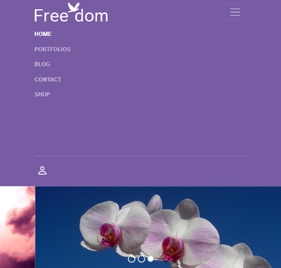

# Freedom
Одностраничник адаптируемый на разные разрешения экрана был преимущественно использован boostrap.
## Технологии


## Bootstrap
В headere был использован bootstrap, при уменьшении разрешения до 992px на экране выходит кнопка с навигацией.Так же был добавлен слайдер.
``` html
	<header>
		<nav class="navbar navbar-expand-lg bg-violet navbar-dark pb-3">
			<div class="container">
				<a class="navbar-brand me-5" href="#">
					
				</a>
				<button class="navbar-toggler" type="button" data-bs-toggle="collapse" data-bs-target="#navigation"
					aria-controls="navigation" aria-expanded="false" aria-label="Toggle navigation">
					<span class="navbar-toggler-icon"></span>
				</button>
				<div class="collapse navbar-collapse" id="navigation">
					<ul class="navbar-nav text-uppercase fw-bold mt-2">
						<li class="nav-item">
							<a class="nav-link active pe-4" aria-current="page" href="#">Home</a>
						</li>
						<li class="nav-item pe-4">
							<a class="nav-link" href="#">Portfolios</a>
						</li>
						<li class="nav-item pe-4">
							<a class="nav-link" href="#">Blog</a>
						</li>
						<li class="nav-item pe-4">
							<a class="nav-link" href="#">Contact</a>
						</li>
						<li class="nav-item pe-4">
							<a class="nav-link" href="#">Shop</a>
						</li>
					</ul>
					<hr class="text-white d-lg-none">
					<button type="button" class="btn-user">
						<i class="bi bi-person"></i>
					</button>
				</div>
			</div>
		</nav>
	</header>
	<div id="main-carousel" class="carousel slide mb-5" data-bs-ride="true">
		<div class="carousel-indicators">
			<button type="button" data-bs-target="#main-carousel" data-bs-slide-to="0" class="active"
				aria-current="true" aria-label="Slide 1"></button>
			<button type="button" data-bs-target="#main-carousel" data-bs-slide-to="1" aria-label="Slide 2"></button>
			<button type="button" data-bs-target="#main-carousel" data-bs-slide-to="2" aria-label="Slide 3"></button>
		</div>
		<div class="carousel-inner">
			<div class="carousel-item active">
				
			</div>
			<div class="carousel-item">
				
			</div>
			<div class="carousel-item">
				
			</div>
		</div>
		<button class="carousel-control-prev" type="button" data-bs-target="#main-carousel" data-bs-slide="prev">
			<span class="visually-hidden">Previous</span>
		</button>
		<button class="carousel-control-next" type="button" data-bs-target="#main-carousel" data-bs-slide="next">
			<span class="visually-hidden">Next</span>
		</button>
	</div>


```


## Команда проекта


- [Макыев Данияр] — Front-End developer
